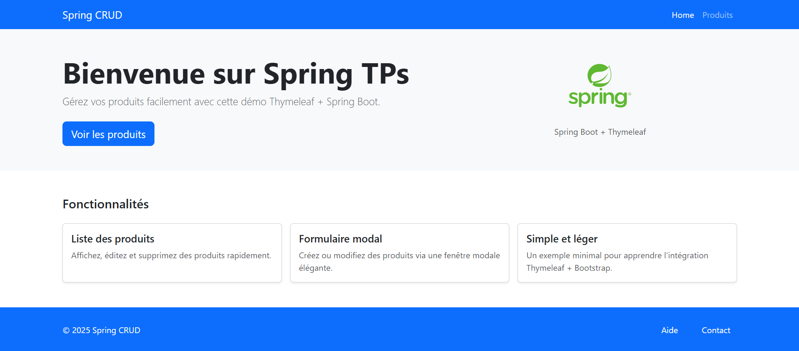
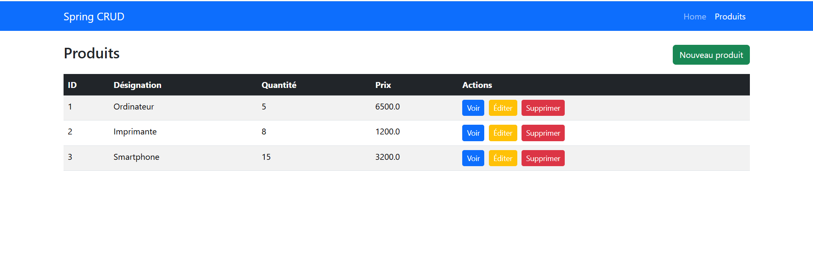
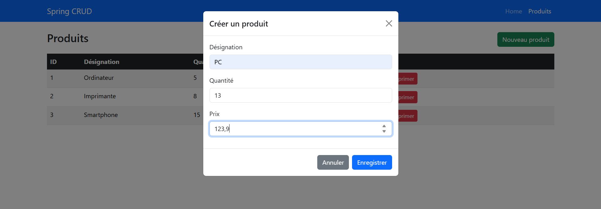
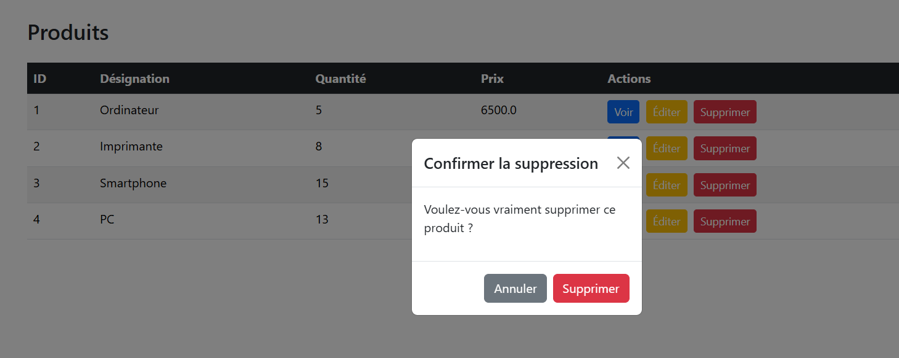

# Spring CRUD Demo

This project is a simple Spring Boot application demonstrating CRUD operations for managing products, using Thymeleaf for the frontend and Bootstrap for styling.

## Features

- List products
- Create, edit, and delete products via modal forms
- View product details in a modal
- Responsive UI with Bootstrap

## Screenshots






## Technologies

- Java
- Spring Boot
- Spring Data JPA
- Thymeleaf
- Bootstrap

## Getting Started

### Prerequisites

- Java 17+
- Maven

### Running the Application

1. Clone the repository:
   ```sh
   git clone https://github.com/momonaim/spring-crud-produits
   ```
2. Navigate to the project directory:
   ```sh
   cd spring-crud-produits
   ```
3. Build and run:
   ```sh
   ./mvnw spring-boot:run
   ```
   Or on Windows:
   ```sh
   mvnw.cmd spring-boot:run
   ```
4. Open your browser and go to [http://localhost:8080](http://localhost:8080)

## Project Structure

- `src/main/java/ma/fsts/spring_crud/` - Main application code
- `src/main/resources/templates/` - Thymeleaf HTML templates
- `pom.xml` - Maven configuration

---

© 2025 Spring CRUD Demo
